# 🌿 Grove — 주니어를 위한 경력·활동 자산화 플랫폼

<p align="center">
  흩어진 경험을 모아, 나만의 포트폴리오로 만들어보세요.<br/>
  자격증, 프로젝트, 교육, 스킬까지 한 곳에서 관리하고<br/>
  원하는 경험만 선택해 포트폴리오를 완성하세요.
</p>

<p align="center">
  
  
  
</p>

<p align="center">
  <a href="https://react-porters-grove.vercel.app">🌐 배포 링크</a>
</p>

> **25-2 파란학기 Porters팀 프로젝트** | 2025.06 ~ 2026.01
> 프론트엔드 리드 개발자 — 웹 전체 화면 담당

---

## 프로젝트 소개

취업을 준비하는 주니어들이 자신의 경험을 체계적으로 관리하고,
원하는 경험만 선택해 포트폴리오로 만들 수 있는 플랫폼입니다.

스펙을 쌓을수록 어딘가에 흩어져 있는 경험들을 한 곳에서 모으고,
지원하는 곳에 맞게 포트폴리오를 조합할 수 있도록 설계했습니다.

---

## 화면 미리보기

### 홈 대시보드
> 나의 경험 현황, 목표 시각화, 진행 중인 경험 노트를 한눈에 확인

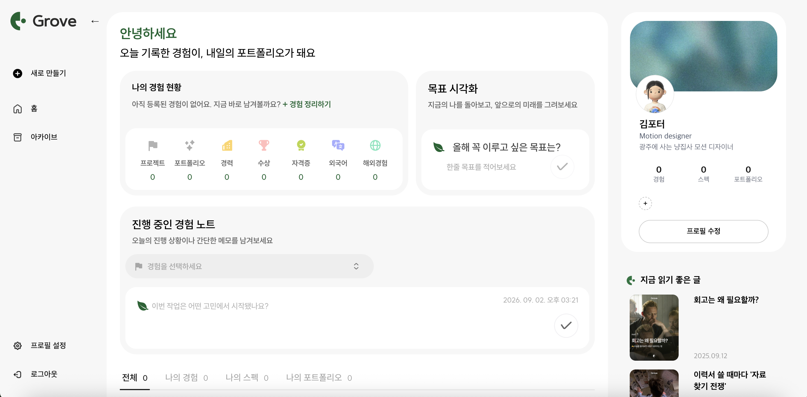

---

### 경험 등록 — 카테고리 선택
> 경험(프로젝트·공모전·교내활동 등) / 스펙(자격증·수상·어학) / 포트폴리오 중 선택

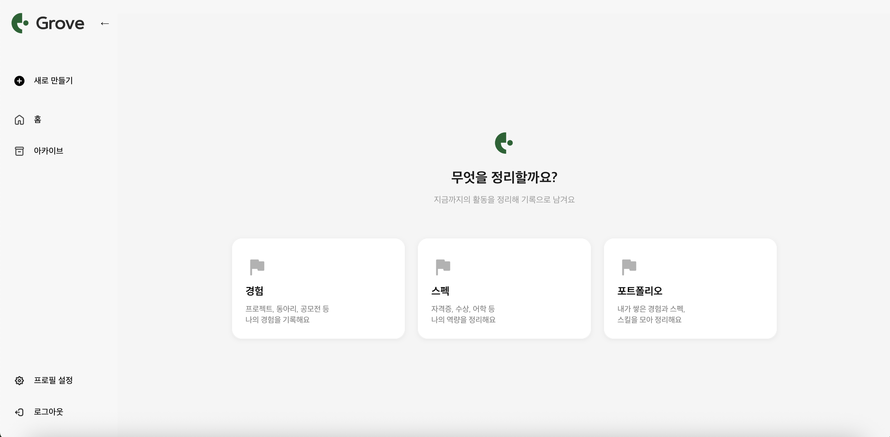

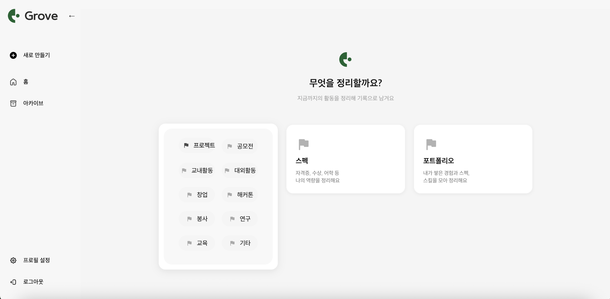

---

### 경험 등록 — 기본 정보 및 STAR 기법 작성
> 프로젝트명, 내용 설명, 역할, 진행 기간, 관련 자료 첨부

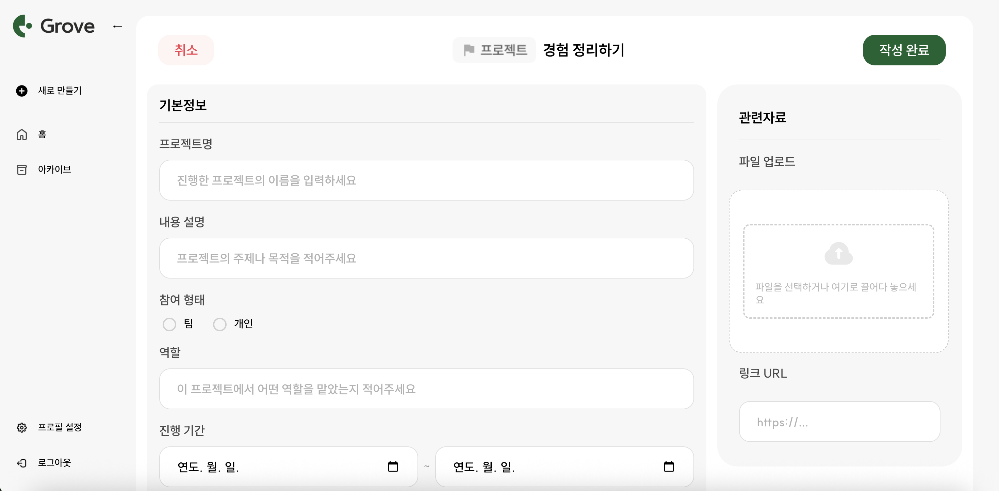

> Situation(상황) → Task(과제) → Action(행동) → Result(결과) 구조로 경험을 체계적으로 기록

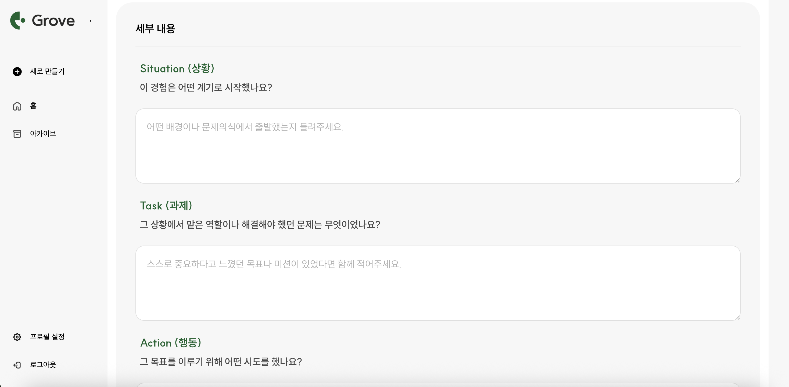

---

### 포트폴리오 생성 — 3단계 플로우

**1단계: 경험 선택**
> 등록된 경험 중 포트폴리오에 담을 경험을 선택

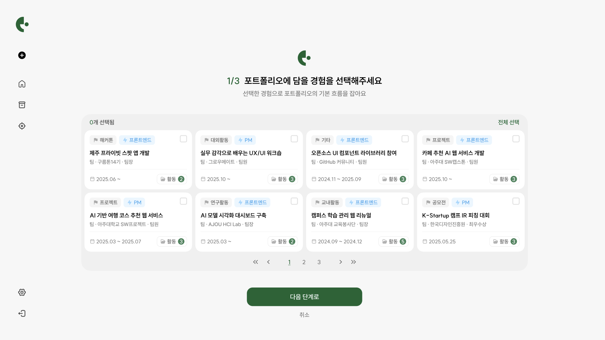

**2단계: 키워드 선택**
> 나를 나타내는 키워드 3가지를 선택해 포트폴리오의 방향 설정

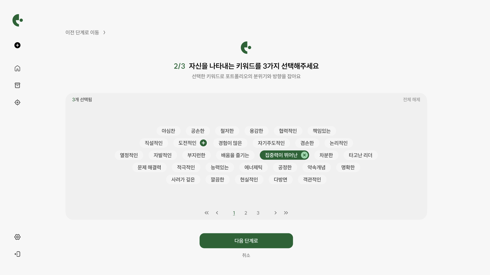

**3단계: 자기소개 작성**
> 나는 어떤 사람인지, 가장 큰 강점과 성장 방향을 작성

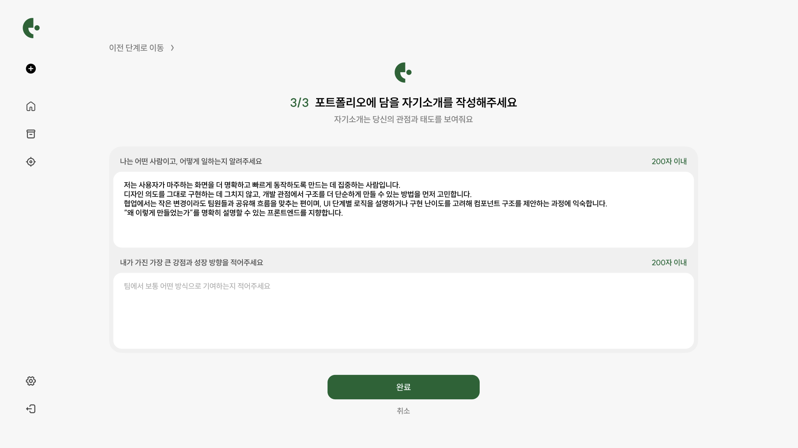

**완성 — PDF 저장**
> 포트폴리오 완성 후 PDF로 저장하거나 아카이브에 보관

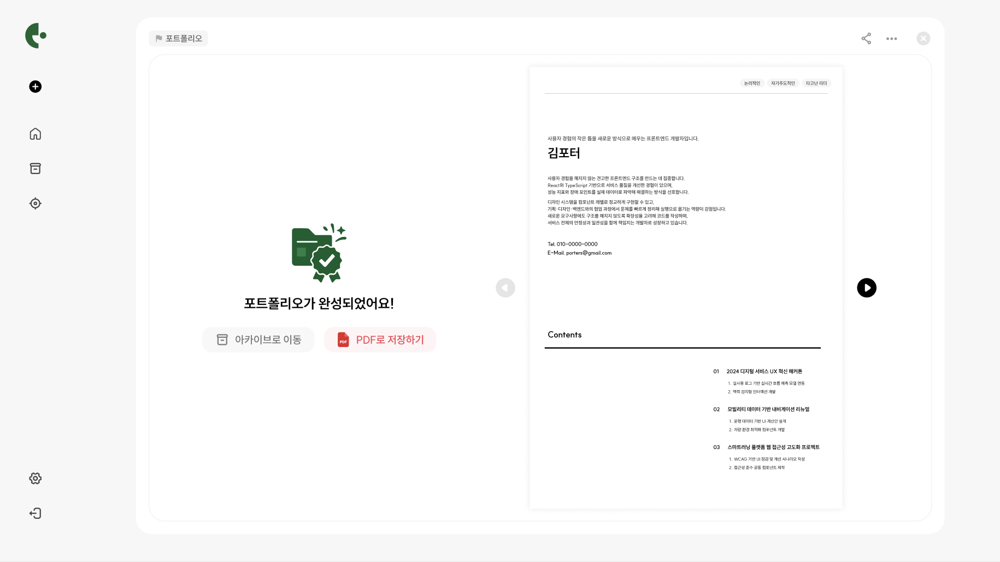

---

### 아카이브 — 나의 경험·스펙·포트폴리오 관리
> 등록한 경험과 스펙을 카드 뷰로 한눈에 확인하고 포트폴리오로 조합

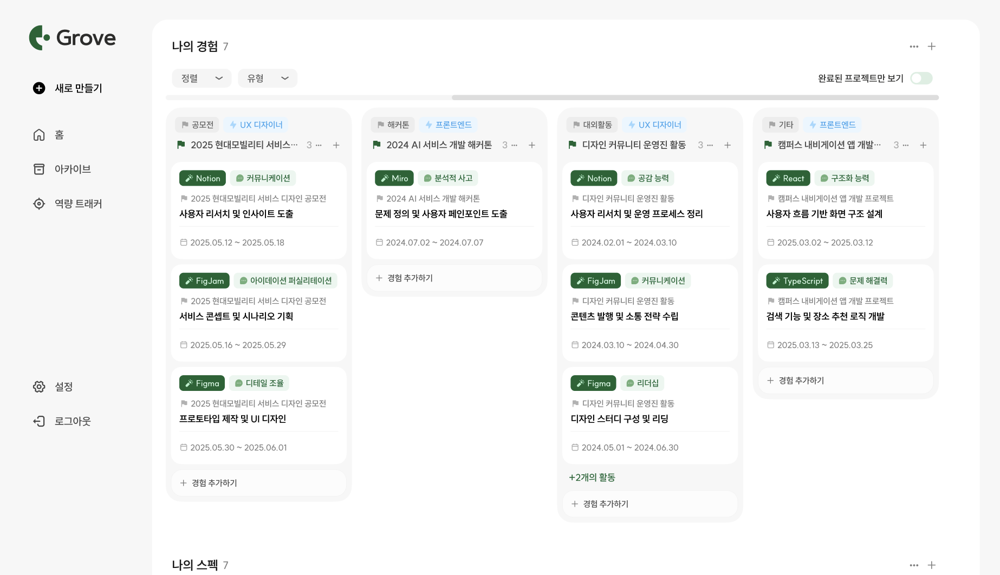

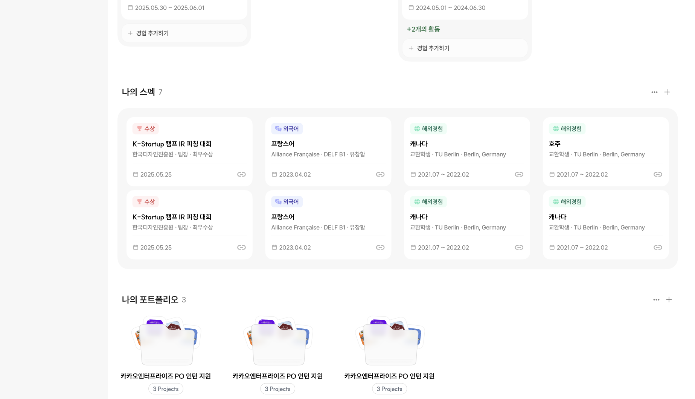

---

## 주요 기능

### 경험 등록 및 관리
- 프로젝트·공모전·교내활동·대외활동·창업·해커톤·봉사·연구·교육 등 다양한 유형 지원
- 자격증·수상·어학·해외경험 등 스펙 항목 별도 관리
- **STAR 기법**(Situation·Task·Action·Result)으로 경험을 체계적으로 기록
- 관련 파일 업로드 및 링크 URL 첨부 가능

### 포트폴리오 생성
- 경험 선택 → 키워드 선택 → 자기소개 작성의 **3단계 플로우**로 포트폴리오 생성
- 완성된 포트폴리오 **PDF 저장** 가능
- 여러 버전의 포트폴리오를 만들어 상황에 맞게 활용

### 아카이브
- 나의 경험·스펙·포트폴리오를 카드 뷰로 한눈에 확인
- 정렬·유형 필터링, 완료된 프로젝트만 보기 기능

### 프로필 관리
- 기본 프로필 정보 등록 및 수정
- 목표 시각화 및 진행 중인 경험 노트 기능

### 인증
- 소셜 로그인
- 자체 회원가입 및 로그인

---

## 기술 스택

| 분류 | 기술 |
|---|---|
| Frontend | React, JavaScript |
| 배포 | Vercel |
| 협업 | Git, GitHub |

---

## 담당 화면

| 화면 | 설명 |
|---|---|
| 메인(홈) 페이지 | 경험 현황·목표 시각화·경험 노트 대시보드 |
| 새로 만들기 | 경험·스펙·포트폴리오 카테고리 선택 화면 |
| 경험 등록 페이지 | 기본 정보 입력 + STAR 기법 세부 작성 |
| 포트폴리오 생성 | 경험 선택 → 키워드 선택 → 자기소개 작성 3단계 플로우 |
| 아카이브 페이지 | 경험·스펙·포트폴리오 카드 뷰 관리 |
| 프로필 페이지 | 사용자 정보 및 경험 목록 관리 |
| 회원가입 / 로그인 | 자체 인증 및 소셜 로그인 |

> 프론트엔드 리드로서 위 전체 화면의 UI 설계 및 개발을 담당했습니다.

---

## 기술적 도전 & 해결

**백엔드 로그인 API 연동 이슈**
- 프론트엔드와 백엔드 간 토큰 처리 방식 및 CORS 설정 불일치로 인증 오류 발생
- 백엔드 개발자와 밤새 디버깅하며 API 명세를 재정의하고 해결
- 사전 API 명세 정의의 중요성을 체감하게 된 계기

**팀원 일정 관리**
- 팀원의 R&D 지연으로 전체 일정이 반복적으로 밀리는 상황 발생
- R&R을 명확히 재정리하고 마감기한을 문서로 명시하며 조율
- 결과적으로 프로젝트를 기한 내 완료

---

## 실행 방법

```bash
# 의존성 설치
npm install

# 개발 서버 실행
npm start

# 빌드
npm run build
```

> ⚠️ 현재 백엔드 서버가 운영 중단되어 로그인·데이터 연동 기능은 동작하지 않습니다.
> 프론트엔드 화면은 [배포 링크](https://react-porters-grove.vercel.app)에서 확인 가능합니다.

---

## 팀 구성
 
총 7명
 
| 역할 | 인원 |
|---|---|
| PM | 2명 |
| 디자이너 | 1명 |
| 프론트엔드 | 2명 (리드: 김정하 / juunghaa) |
| 백엔드 | 2명 |
 
---

## 💡 배운 점

- 기획 단계에서의 **명확한 API 명세와 R&R 정의**가 협업 전체의 효율을 결정짓는다는 것
- 프론트엔드와 백엔드 간 **소통 방식과 개발자 협업 문화**를 직접 체득
- PM에게 배운 **기획안 작성, 회의 진행, 명세서 구성** 방식이 이후 모든 프로젝트의 기반이 됨
